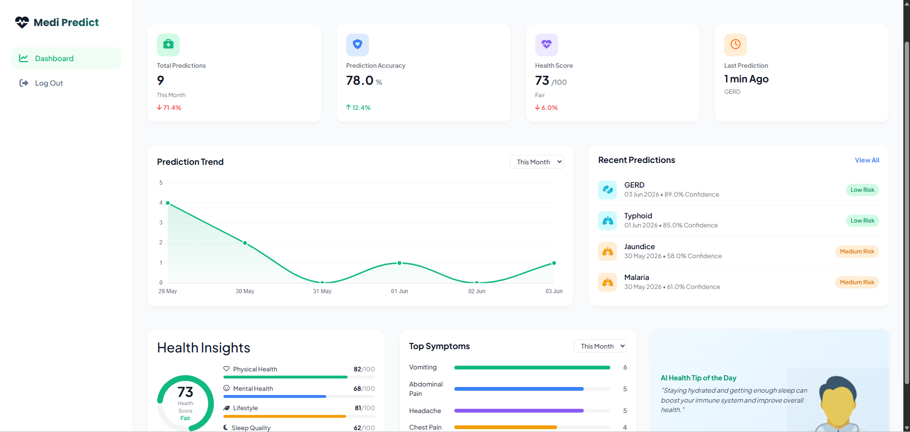

# Intelligent HealthSense Disease Predictor Using Machine Learning

## Overview

Intelligent HealthSense is a Machine Learning-powered healthcare application that predicts diseases based on user symptoms and provides healthcare-related assistance through an interactive web platform.

The system allows users to:

* Predict diseases from symptoms
* View disease-related information
* Consult doctors
* Access a disease information chatbot
* Manage health records through a personalized dashboard

---

## Features

### Disease Prediction

* Predicts diseases using Machine Learning models.
* User-friendly symptom selection interface.
* Instant prediction results.

### Patient Dashboard

* Centralized dashboard for managing healthcare activities.
* Easy navigation to all application modules.

### Disease Information Bot

* Provides disease-related information and guidance.
* Helps users understand symptoms and precautions.

### Doctor Consultation

* Dedicated consultation section.
* Enables users to connect with healthcare professionals.

### User Authentication

* Secure registration and login system.
* Personalized user experience.

---

## Technology Stack

### Frontend

* HTML
* CSS
* JavaScript
* Bootstrap

### Backend

* Python
* Django

### Database

* SQLite

### Machine Learning

* Scikit-Learn
* Pandas
* NumPy

---

## Project Structure

```text
ITM Project
│
├── accounts/
├── chats/
├── disease_prediction/
├── main_app/
├── templates/
├── screenshots/
├── model.pkl
├── manage.py
├── requirements.txt
└── db.sqlite3
```

---

## Installation

### Clone Repository

```bash
git clone https://github.com/bansari2208/Intelligent-Healthsense-disease-Predictor-Using-Machine-Learning-.git
```

### Navigate to Project Directory

```bash
cd Intelligent-Healthsense-disease-Predictor-Using-Machine-Learning-
```

### Create Virtual Environment

```bash
python -m venv venv
```

### Activate Virtual Environment

Windows:

```bash
venv\Scripts\activate
```

### Install Dependencies

```bash
pip install -r requirements.txt
```

### Run Server

```bash
python manage.py runserver
```

---

## Application Screenshots

### Home Page


### Dashboard



### Predict Disease


### Consult Doctor


### Disease Information Bot


---

## Future Enhancements

* AI-powered health assistant
* Appointment booking system
* Medical report analysis
* Cloud deployment
* Advanced disease prediction models

---

## Author

**Bansari Patel**

Artificial Intelligence and Machine Learning 
